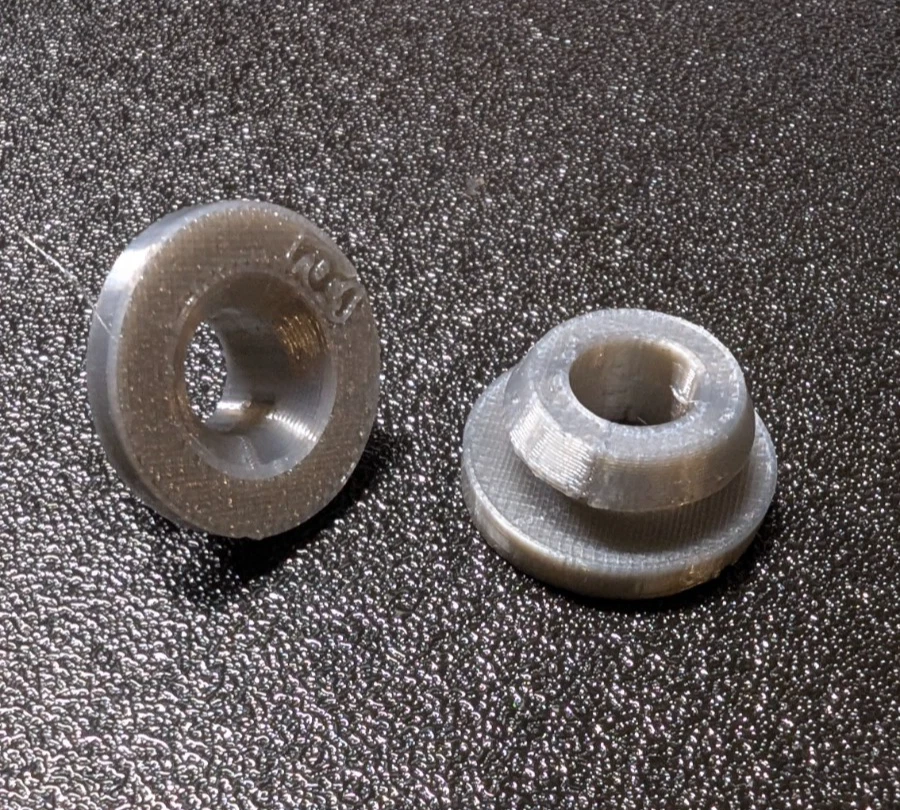

# Harley-Davidson V-Rod Airbox Mounting Bushing

  <b>If this part saved you money, consider buying me a thank you!</b>  
  

---

3D printable TPU replacement for the Harley-Davidson V-Rod airbox cover mounting bushing (OEM 11519) — the rubber grommet the airbox cover prongs press into, frequently lost when the cover is removed.

<h2 align="center"><a href="https://github.com/jdinino/3d-parts/releases/download/airbox-bushing-r03/11519-r03.stl">Download the Bushing</a></h2>
<h3 align="center"><a href="11519-r03.stl">View 3D Model</a> | <a href="https://jdinino.github.io/3d-parts/automotive/harley-davidson-v-rod-airbox-bushing/render.html">Interactive Viewer</a></h3>

  
  

  

## Compatible Part Numbers

| Part Number | Type |
|-------------|------|
| **11519** | Current OEM (RUBBER MOUNT, AIRBOX COVER) |
| 11519-A | Alternate |

## Compatible Motorcycle Models

### Harley-Davidson
- **VRSC V-Rod family** (2002+) — airbox cover mounting
- Later VRSC models also use this grommet for the coolant overflow bottle mount — verify against your model-year parts catalog

## Specifications

| Parameter | Value |
|-----------|-------|
| **Base Flange OD** | 20 mm |
| **Base Flange Height** | 3 mm |
| **Groove (panel snap)** | Ø11 × 3 mm |
| **Head (retention lip)** | Ø16 → Ø13 taper |
| **Overall Height** | 9 mm |
| **Through-Bore** | Ø8, flared to Ø12 at underside |

## Print Settings

The exact validated profile ships as [`11519-r03.3mf`](https://github.com/jdinino/3d-parts/releases/download/airbox-bushing-r03/11519-r03.3mf) — a PrusaSlicer 2.9 project (AnkerMake M5C, 0.4 mm nozzle, Generic TPU 95A). The table below summarizes it.

### Bushing - TPU 95A

| Setting | Required | Value |
|---------|:--------:|-------|
| Layer Height | | 0.2 mm |
| Wall Count | ✓ | **1** (global — do not raise) |
| Groove-Root Reinforcement | ✓ | **2 perimeters on the z 3.0-3.2 mm layer** (height-range modifier in the 3MF) |
| Infill | ✓ | **0%** |
| Print Speed | | 20-25 mm/s effective (profile is volumetric-capped at 1.8 mm³/s) |
| Nozzle Temp | | 225°C |
| Bed Temp | | 30°C |
| Cooling | | 30% constant, off for first 3 layers (auto-cooling disabled) |
| Retraction | | 0.8 mm @ 60 mm/s |
| Orientation | | Base down |
| Supports | ✓ | Enabled — organic style, 0.2 mm contact distance |

**Required settings, and why:**

- **Wall Count 1 + Infill 0%** — deliberate, not a draft setting: the hollow single-wall shell is what makes a 95A filament squish like the softer OEM molded rubber. Printing solid (or with 2 global walls) produces a bushing too stiff to snap into the panel or accept the cover prong.
- **Groove-Root Reinforcement** — the first groove layer is the only material tying the groove stem and head to the base flange. The bushing has to stay squishy and flex to do its job, and printed hollow at a single 0.45 mm perimeter that junction layer is where the flex concentrates: the part looks fine, then tears between the flange and the stem after some flexing. Two perimeters on the Ø8-Ø11 ring effectively fill that junction solid (PrusaSlicer: object → Height range modifier, 3.0-3.2 mm, Perimeters = 2).
- **Supports** — a single perimeter cannot bridge the head underside over the groove; supports tear cleanly out of TPU.

### Material Notes

| Part | Material | Status | Notes |
|------|----------|--------|-------|
| Bushing | TPU 95A | **Recommended** | Tested with hollow print settings above |
| Bushing | TPU 85A | Untested | Closer to OEM durometer; may allow solid print |

## Files

| File | Description |
|------|-------------|
| `11519-r03.stl` | 3D printable model |
| `11519-r03.3mf` | PrusaSlicer project — exact validated print profile |
| `11519-r03.scad` | OpenSCAD parametric source |
| `airbox-bushing-FSD.md` | Functional Specification Document |
| `render.html` | Interactive 3D preview |

## Installation

Installs exactly like the OEM grommet — press in by hand. Printed per the settings above, the part squishes and flexes as good as OEM.

## Revision History

| Rev | Date | Changes |
|-----|------|---------|
| r01 | 2026-07-17 | Initial candidate profiles from OEM part measurement |
| r02 | 2026-07-17 | Bore flare relocated to bottom face |
| **r03** | **2026-07-17** | **Head raised 1 mm (groove 3 mm), flare widened to Ø12, hollow print settings validated, fit-tested** |

## License

[CC BY 4.0](../../LICENSE)

## Contributing

Issues and improvements welcome. Please include:
- V-Rod model and year
- Photo of fitment
- Any dimensional adjustments needed

## Keywords

`11519` `11519-A` `harley-davidson` `harley` `v-rod` `vrsc` `vrsca` `vrscb` `vrscaw` `vrscdx` `vrscf` `airbox` `air box` `airbox cover` `grommet` `bushing` `rubber mount` `overflow bottle` `tpu` `motorcycle` `3d print` `replacement part`

---

  

